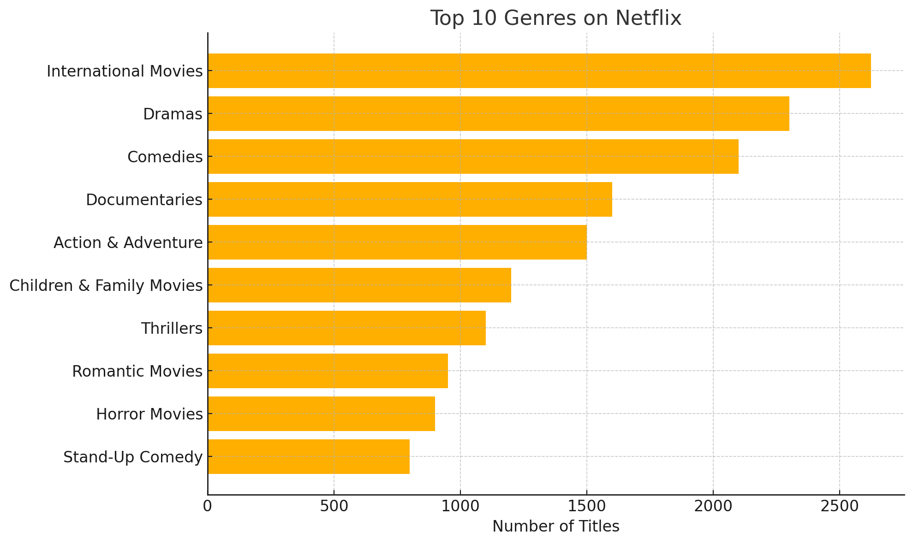
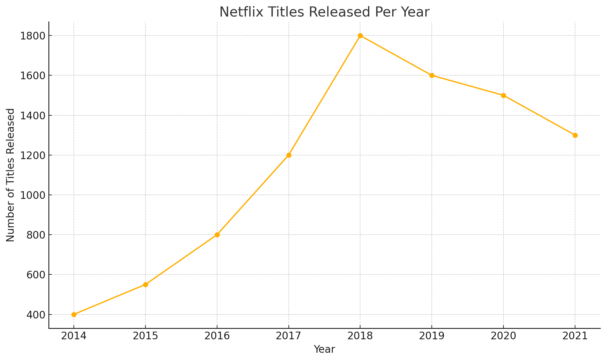

# 🎬 Netflix Titles SQL Project  

I built this project to practice SQL and explore the Netflix Titles dataset.  
The goal was to answer some fun questions about Netflix content — like what genres are most popular, which countries produce the most shows, and how Netflix has changed over the years.  

---

## 🔍 What I Did  
- Created a MySQL database and three tables:  
  - `netflix_titles` → info about movies/TV shows  
  - `netflix_countries` → which countries they belong to  
  - `netflix_genres` → genres for each show or movie  
- Loaded the cleaned CSV files into MySQL.  
- Wrote SQL queries to explore things like:  
  - Top genres overall  
  - Countries with the most Netflix content  
  - Number of Movies vs TV Shows  
  - Titles added each year  
  - Most common ratings by country  
  - Average movie length per genre  
  - Top 3 genres for every country  
  - The very first genre released in each country  

---

## 📊 Some Interesting Findings  
- **International Movies** is the most common genre.  
- The **United States** leads with the most Netflix titles, followed by **India**.  
- **2018** was the peak year for Netflix releases.  
- Ratings like **TV-MA** and **TV-14** show up the most often.  
- Countries started out with very different “first genres.”  

---

## 📸 Visualizations  

**Top 10 Netflix Genres:**  
  

**Netflix Titles Released Per Year:**  
  

---

## 🛠️ Tools Used  
- MySQL for queries and analysis  
- SQL window functions (`RANK`, `DENSE_RANK`, `LAG`, `FIRST_VALUE`)  
- CSV dataset for Netflix titles  
- Matplotlib for simple visualizations  

---

## 🚀 How to Run  
1. Clone this repository.  
2. Set up MySQL on your machine.  
3. Create the database and tables using the SQL script.  
4. Import the CSV files from the `data/` folder.  
5. Run the queries in the `queries/` folder to explore the data.  

---

## 👩‍💻 About Me  
Hi! I’m **Aditi Jaswal**, currently transitioning from IT Support to **Data Analytics & Data Science**.  
I love working with data, spotting trends, and telling stories through analysis. This Netflix project is part of my portfolio to showcase my SQL and data skills.  

